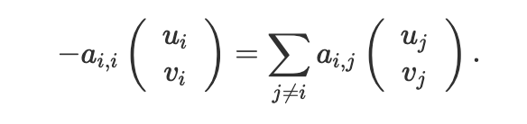

## Project Description:

Our project focuses on parameterizing a mesh. Parameterizing a mesh involves taking a 3D surface and creating a 2D representation of that surface. We implemented a parameterization algorithm that can take a 3D surface and map it onto a circle or a square with two different weighting systems: uniform weighting and mean-value weighting.

Our parameterization works by first reading in some mesh that is homeomorphic to a disc and has only one connected boundary. We then initiliaze four vectors: u, v, ubar, and vbar. u and v are the x and y coordinates of the points on the 2D surface while ubar and vbar hold the boundary vertices. We get all the boundary vertices with our method get_boundary_edges.

Next, we determine the parameter space coordinates of each boundary vertex and store these desired coordinates in ubar and vbar. Determining these parameter space boundary coordinates depends on if we want a square boundary or a circular boundary. For a circular boundary, we use trigonmetry to determine the x and y coordinates of the boundary vertices. We move around the circle from theta = 0 to theta = 2π with our change in theta being determined by the value 2π/(the number of boundary vertices). For a square boundary, we go around theta in much the same way, but instead of using trigonmentry, we use vector addition. Our square is oriented as a diamond, and go from 0 to π/2, π/2 to π, π to 3π/2, and 3π/2 to 0. At each of these discrete ranges, we perform vector addition with the "radius of the square" (half the length of the side of the square) and the side of the square we are currently looking at (this is determined by what theta range we are in). See the diagram below for an example of determing a boundary point's coorindates in the 0 to π/2 range:

Here vector 2 is a fraction of vector 1 and that fraction is determined by theta. With the "radius" and vector 2 determined - we can add them to get a resultant vector that give us the coordinates we want for ubar and vbar.

With the boundary vertices determined, we then create a sparse matrix. We use a sparse matrix so that we store only nonzero values and do not spend a lot more time computing our parameter space points.

Now we need to determine where the interior points must lie in the parameter space. We can do this using two techniques: uniform weighting, and mean-value weighting. For both methods, we go through every point p and determine a weight to assign to each edge for the one-ring of p. The negative sum of those weights is the weight of the point p. We determine the weight of any edge to be 1 in the uniform weighting method. However, we determine the weight of an edge a different way when constructing a parameterization with mean-value weighting.

Here, we find the edge between two points xi and xj. Then we find the left and right vertices of those points (lv and rv). Then we find δi,j γi,j​​ using the dot products and cross products. Here is a sample diagram:

After gathering these values we use this equation to determine the weight. Here is the equation:

For both methods, if p is on the boundary, then the weight of the point is just 1. All of these weights are put into our matrix A at the index of the point -> Aii. All points will be at an index Aii where i is some number since Aij for j not equal to i will describe an edge between the point at Aii and Ajj.

Finally, after filling in our matrix A, we solve a systems of equation: A _ u = ubar and A _ v = vbar. We solve this systems of equations for u and v. Solving this system requires us to implement openNL. Solving for u and v gives us the x and y coordinates for our parameterization. We then update these coordinates into our mesh by looping through and changing the vertices in the mesh.

Finally, we add the updated mesh to the viewer and run the viwer. Here is some general pseudocde for a parameterization:

This is a fixed-boundary method for parameterization made possible only by Tutte's embedding theorem. The theorem gives us the equation below:

Where we have these properties:

## Project Examples:

#### Lion 3D Surface

#### Lion Parameterization - Uniform Weighting/Circular Boundary

#### Lion Parameterization - Uniform Weighting/Square Boundary

#### Lion Parameterization - Mean-Value Weighting/Circular Boundary

#### Lion Parameterization - Mean-Value Weighting/Square Boundary

## Analysis

Runtime:  
Lion 3D Surface: 3e-06 seconds  
Lion Parameterization - Uniform Weighting/Circular Boundary: 14.4431 seconds  
Lion Parameterization - Uniform Weighting/Square Boundary: 14.1532 seconds  
Lion Parameterization - Mean-Value Weighting/Circular Boundary: 14.6187 seconds  
Lion Parameterization - Mean-Value Weighting/Square Boundary: 14.3955 seconds

Number of vertices is the same for all runs: 8356.
